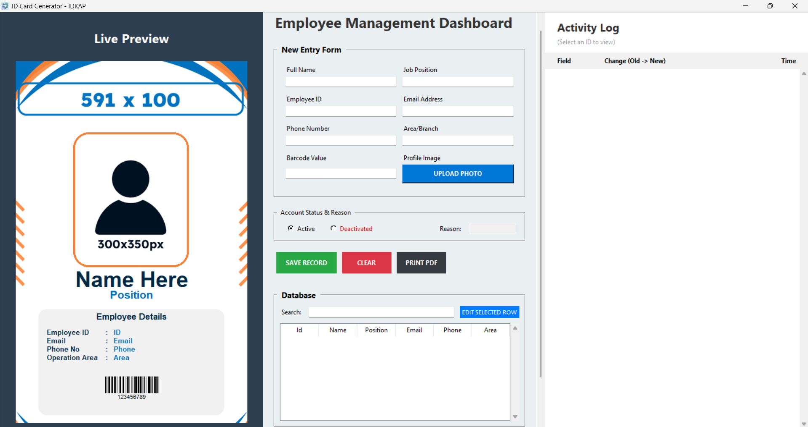

# IDKAP - Professional ID Card Generator


**IDKAP** is a comprehensive desktop application for designing, managing, and printing professional employee ID cards. Built with Python, it features a real-time visual editor, barcode generation, and a robust audit trail system.


*(The IDKAP Main Dashboard)*

---

## ✨ Key Features

* **Live Visual Editor:** See changes to the ID card in real-time as you type.
* **Database Management:** Automatically saves employee records to a local JSON database.
* **Audit Logging:** Tracks every change (Email updates, Status changes, Photo updates) with timestamps.
* **Smart Status System:** Mark employees as "Active" or "Deactivated" with reason tracking.
* **Barcode Integration:** Generates scan-ready Code128 barcodes automatically.
* **One-Click PDF:** Exports print-ready files to a dedicated folder.

## 🚀 How to Run

### Option 1: Run the Standalone EXE (Windows)
1.  Download `IDKAP.exe` from the Releases section.
2.  Double-click to run. No installation required.

### Option 2: Run from Source Code
1.  Clone this repository:
    ```bash
    git clone [https://github.com/ash4code/IDKAP.git](https://github.com/ash4code/IDKAP.git)
    ```
2.  Install dependencies:
    ```bash
    pip install -r requirements.txt
    ```
3.  Run the app:
    ```bash
    python main.py
    ```

## 🛠️ Building the EXE

To build the executable yourself (requires PyInstaller):

```bash
pyinstaller main.spec
